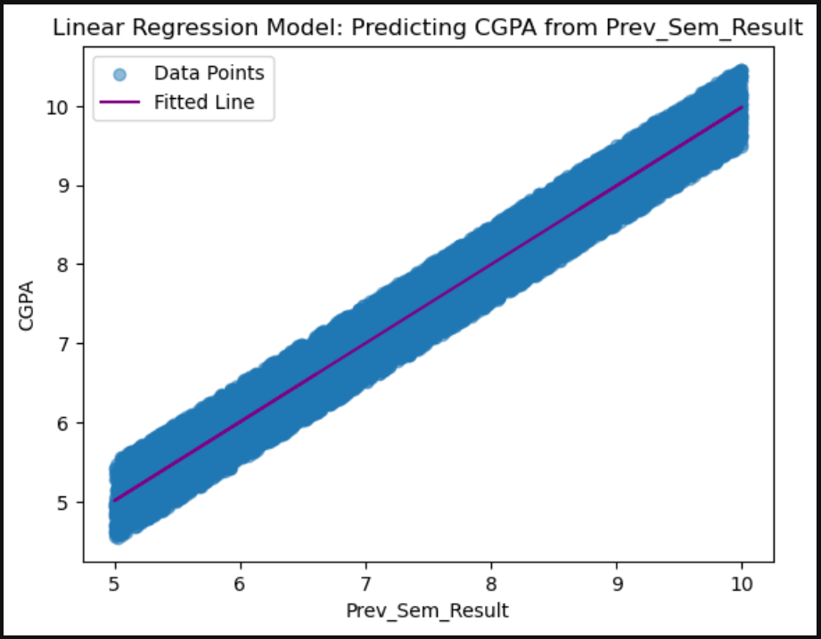

# 🎓 Predicting CGPA Based on Previous Semester Result

This beginner-friendly machine learning project uses **linear regression** to predict a student's **Cumulative GPA (CGPA)** based on their **Previous Semester Result**.  
It is part of a learning path inspired by the [Microsoft Learn: Introduction to Machine Learning](https://learn.microsoft.com/training/).


## 📊 Dataset Description

The dataset is taken from the **College Student Placement Factors Dataset**, a synthetic but realistic dataset simulating 10,000 students.

For simplicity, this project uses only two columns:

- `Prev_Sem_Result`: GPA of the student in the previous semester  
- `CGPA`: The cumulative GPA across all semesters

🔗 **Dataset Source:**  
[https://www.kaggle.com/datasets/sahilislam007/college-student-placement-factors-dataset](https://www.kaggle.com/datasets/sahilislam007/college-student-placement-factors-dataset)


## 🔧 Modeling Approach

We trained an **Ordinary Least Squares (OLS)** linear regression model using the `statsmodels` Python library to identify the relationship between previous semester GPA and CGPA.

### Steps:
1. Load and prepare the dataset (`college_student_placement_dataset.csv`)
2. Extract the relevant columns
3. Train a linear regression model
4. Plot the data and the regression line
5. Predict CGPA for test data and compare to actual values


## 📈 Sample Results

| Prev_Sem_Result | Actual CGPA | Predicted CGPA |
|-----------------|-------------|----------------|
| 8.41            | 8.29        | 8.40           |
| 9.25            | 9.34        | 9.24           |
| 6.08            | 6.25        | 6.08           |
| 8.77            | 8.92        | 8.76           |
| 9.41            | 9.77        | 9.40           |


## 📉 Visualization

The scatter plot below shows the data points along with the fitted regression line:




## 🚀 How to Run

### 🔧 Prerequisites

- Python 3.x
- Jupyter Notebook or JupyterLab
- Required libraries:
  ```bash
  pip install pandas matplotlib statsmodels
